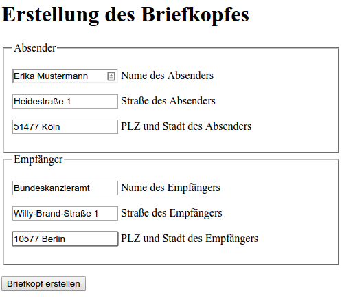

# Brieffenster-Generator

Sometimes, you just need the header.

* Live @ [https://brieffenster.jonasgroeger.de/](https://brieffenster.jonasgroeger.de/)
* [Installation screencast @ Asciinema.org](https://asciinema.org/a/394598)

# Screenshots

## WebUI

## The generated PDF

[Generated Briefkopf](screenshots/Generated-Briefkopf.pdf)

# Run

1. Change the `SECRET_KEY` in `src/brieffenster.py`.
2. ./build-docker
3. ./run-docker
4. Go to [the frontend](http://localhost:10000/)

# Optional: Automation
The PDF generation can be automated using a HTTP POST request, using i.e. `curl`:

    curl -X POST 'http://localhost:10000/generate/' \
        -F "abs_name=Erika Mustermann" \
        -F "abs_street=Heidestraße 1" \
        -F "abs_city=51477 Köln" \
        -F "empf_name=Bundeskanzleramt" \
        -F "empf_street=Willy-Brand-Straße 1" \
        -F "empf_city=10577 Berlin"

# License
This project is licensed under the MIT License. See `LICENSE.md`
