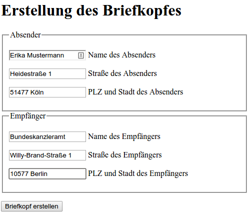

# Brieffenster-Generator

Sometimes, you just need the header.

* Live @ [https://brieffenster.jonasgroeger.de/](https://brieffenster.jonasgroeger.de/)
* [Installation screencast @ Asciinema.org](https://asciinema.org/a/394598)

# Screenshots

## WebUI



## The generated PDF

[Generated Briefkopf](screenshots/Generated-Briefkopf.pdf)

# Run

## Using Docker (recommended)

1. Create a `.env` file with your `SECRET_KEY`:
   ```bash
   cp .env.example .env
   # Edit .env and set a strong SECRET_KEY
   ```
2. Build and run:
   ```bash
   docker compose up --build
   ```
3. Go to [the frontend](http://localhost:10000/)

## Development (without Docker)

1. Create a `.env` file:
   ```bash
   cp .env.example .env
   # Edit .env and set a strong SECRET_KEY
   ```
2. Install dependencies:
   ```bash
   uv sync
   ```
3. Run the development server:
   ```bash
   uv run --env-file .env python -m brieffenster_generator.app
   ```
4. Go to [the frontend](http://localhost:5000/) (default Flask port)

# Form Validation

The application validates all required fields on the server side. Client-side validation (HTML5 `required` attributes) is included for user convenience, but all validation is performed server-side for security.

# Optional: Automation

The PDF generation can be automated using a HTTP POST request with `curl`:

```bash
curl -X POST 'http://localhost:10000/generate/' \
    -F "abs_name=Erika Mustermann" \
    -F "abs_street=Heidestraße 1" \
    -F "abs_city=51477 Köln" \
    -F "empf_name=Bundeskanzleramt" \
    -F "empf_street=Willy-Brand-Straße 1" \
    -F "empf_city=10577 Berlin" \
    --output Briefkopf.pdf
```

All form fields are required. Missing or empty fields will result in a 400 error response.

# License
This project is licensed under the MIT License. See `LICENSE.md`
